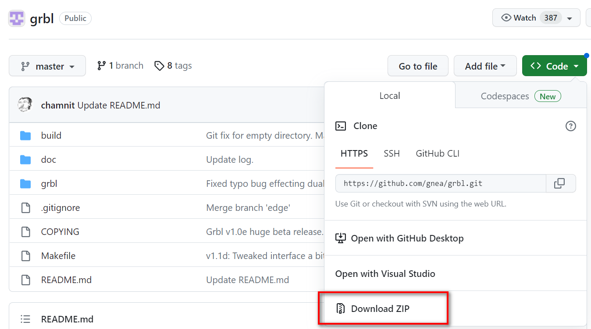
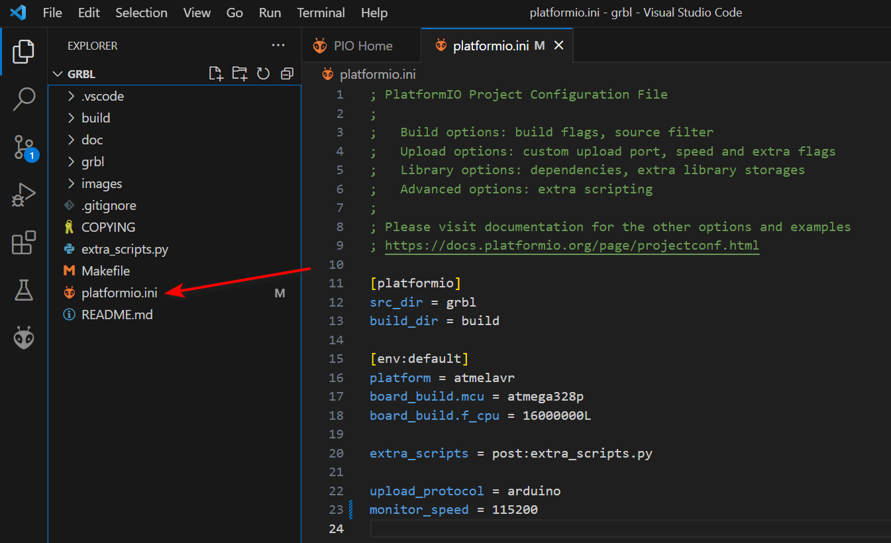
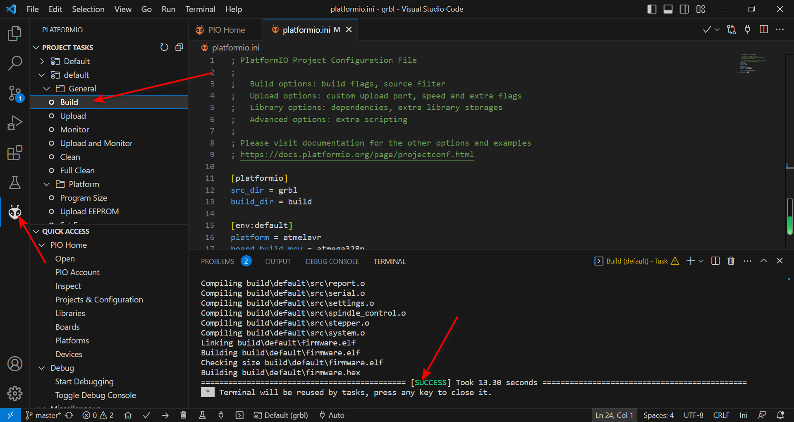
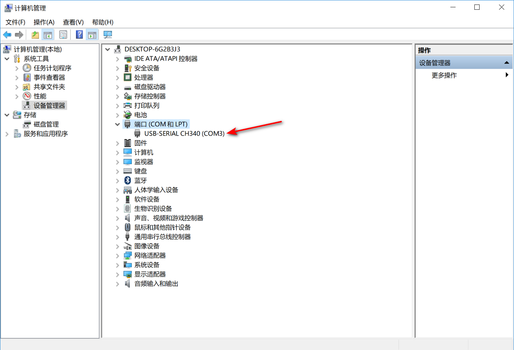
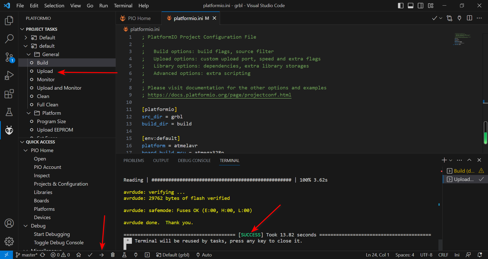
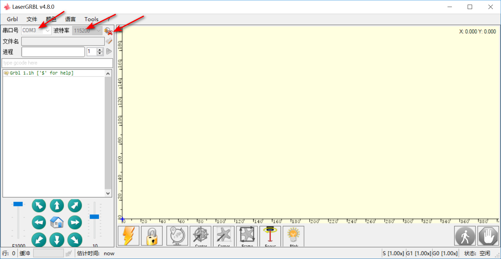

# 开始

## 下载grbl源代码
一般情况下，我们只需要在ArduinoIDE中下载grbl库，然后引用它的头文件即可使用，但是我们是为了研究它的源码，所以我们需要从github下载它的源代码，仓库地址为：[https://github.com/gnea/grbl](https://github.com/gnea/grbl),你可以使用版本管理工具`git`克隆它，也可以下载压缩包（作者推荐）。
   

## 为grbl源码添加platformio支持
1. 我们下载并安装`Virtual Studio Code`（下称VScode），然后再搜索安装VScode的插件`platformio`（PlatformIO（也称PIO）是一款开源且跨平台的嵌入式系统与产品程序的开发工具，可用于多种嵌入式架构与平台的开发。它也为VScode提供了插件）。
2. 用VScode打开下载的grbl源代码并创建一个名为`platformio.ini`的文件，内容如下：   
```
[platformio]
src_dir = grbl # 指定源代码位置
build_dir = build # 指定构建输出位置

[env:default]
platform = atmelavr # 指定单片机平台
board_build.mcu = atmega328p # 指定MCU
board_build.f_cpu = 16000000L # 指定CPU频率，这里使用的是16M晶振

upload_protocol = arduino # 指定烧录协议
monitor_speed = 115200 # 指定串口监控波特率，如果你使用PIO自带的串口监视的话
```
   

## 编译grbl源代码
点击VScode左侧的PIO图标，在菜单中选择`build`，如果编译成功，则会在右下侧输出success标记。如果不成功，请确保步骤跟上面说的一致，还不成功的话自行查找问题，直到成功为止。如下图：   
  

## 连接Arduino到电脑
用USB线连接Arduino和电脑，在电脑的硬件管理器中会看到虚拟出来的串口，如果没有识别出来，需要安装Arduino串口芯片驱动。如下图：   
   

## 烧录grbl固件
点击upload按钮，PIO会自动查找可用的串口，等待上传成功即可。如下图：   


## 连接上位机
下载上位机软件`lasergrbl`并安装，在左侧的串口连接区选择对应的串口点击连接，连接成功后会出现经典的grbl欢迎信息。如下图：    
   

至此，grbl源码的准备工作已做好，我们将用VScode做编辑器，用PIO做为编译器工具，用lasergrbl做上位机和grbl进行交互。如果你已经完成，恭喜你，请为你自己点个赞，为自己点赞的同时也别忘了给我点个赞^_^。
