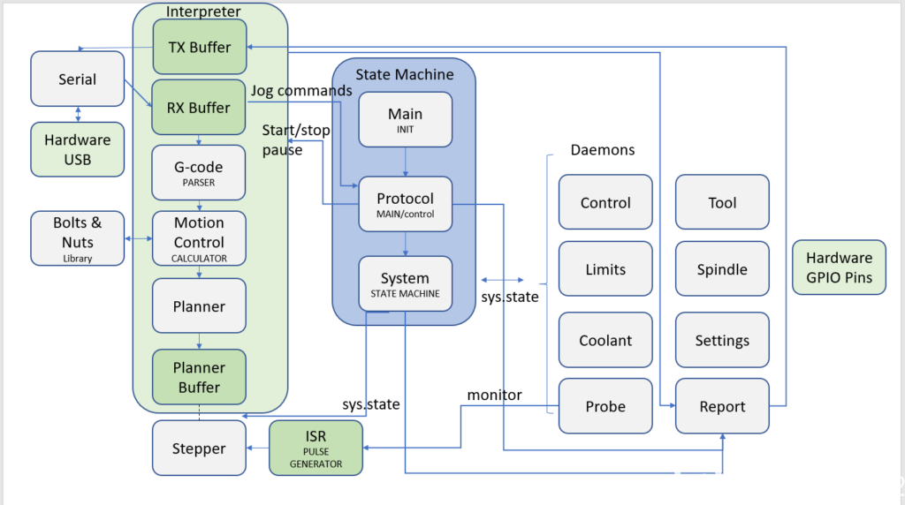

# 架构
Grbl的核心是带有梯形加减速过程的直线插补算法的实现，它包含一个G代码的解析器，一个全局状态机，还有一系列的守护进程。通过调用链分析，得到下图：   

  

Grbl运行在 Arduino UNO 硬件上，但是它并没有使用Arduino框架，原因在于Arduino的芯片atmega328p资源有限，而且Arduino框架占用了某些资源（比如定时器）。因此grbl所有的库都是自己封装的，通过操作寄存器实现的。通过grbl源码，我整理出了以下模块的作用：   

- **主入口：**   

    main.c 初始化外设，开启主循环

- **串口通信：**

    serial.c：低阶串口通信并为异步控制检出运行时的实时命令。

    report.c：通知状态映射和消息组装

    print.c：打印不同格式字符串的函数（用在串口）

- **主循环：**

    protocol.c: 从串口接受命令行并把他们传递到“gcode”执行。提供每个命令的状态响应。还管理串口中断的运行时命令集。

    gcode.c：从“protocol”接收g代码，按照解析器的当前状态解析它并且通过“xxx_control”模块发出命令

- **运动规划模块：**

    motion_control.c: 从“gcode”接收移动命令并且传递他们到规划器。这个模块为规划器模块或步进电机模块提供公共接口。

    planner.c: 从“motion_control”接收线性移动命令并且把他们添加到准备移动的计划中。它维护持被添加的移动续优化加速度路径。

- **动作模块：**

    stepper.c：按计划用步进电机按步执行移动

    spindle.c: 控制主轴的命令

    coolant_control.c：控制主轴冷却的命令

- **输入控制模块：**

    limits.c：配置限位开关，用来告诉机器源点位置，阻止超出行程范围

    probe.c：对刀，告知Z轴0点位置

    jog.c：手动控制机器移动

    system.c：解析并执行系统命令（$开头），外部控制按钮响应

- **参数设置模块：**

    settings.c：在eeroom中维护运行时配置项并且让它对所有模块可用

    config.h：编译时的用户配置

    eeprom.c：一个Atmel的库，提供方法读或写eerom，添加了一点东西可以在读写二进制流的时候检查配置项的校验和。

- **引脚映射模块：**

    cpu_map.h：定义MCU的引脚对应关系

- **辅助模块：**

    nuts_bolts.c：一些全局变量定义，到处被用到的有用的常量、宏。 
